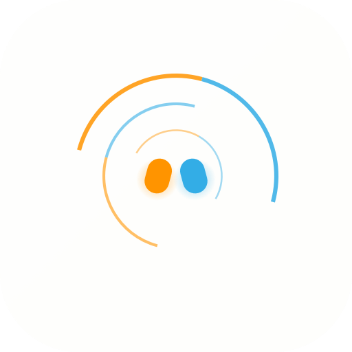

<p align="center">
  
</p>

<h1 align="center">Gstrl</h1>

<p align="center">
  
  
  
  
</p>

**Gstrl** adds gesture, voice, and AI agent control to macOS. **Pinch to move cursor. Swipe for arrows. Hold fists to talk to Claude. Circle to screenshot.** All on-device via Apple Vision + SFSpeechRecognizer.

<p align="center">
  
</p>

For when you're lying back, vibe coding, presenting, or just tired of gripping a mouse or using trackpad all day.

## Install

```bash
git clone https://github.com/TomYang-TZ/Gstrl.git
cd Gstrl
make install   # builds + installs to /Applications
```

```bash
make run       # build + launch
make restart   # stop + rebuild + launch
make stop      # kill it
```

App auto-opens permission pages on first launch (Camera, Accessibility, Screen Recording, Speech).

## Gestures & Voice

### Left Hand (action hand)

| Gesture | Action |
|---------|--------|
| 👌 Quick pinch (thumb + index) | Click |
| 👌 Long pinch + right hand present (hold 1s) | Right click |
| ☝️ Hold 1–3 fingers | Type 1, 2, or 3 |
| ✊ Hold fist | Enter |
| 🤙 Six (hold) | Escape |

### Right Hand (navigation hand)

| Gesture | Action |
|---------|--------|
| 👌 Pinch + move | Move cursor |
| 👌 Pinch + draw circle | Screenshot circled area → clipboard |
| ✊ Fist (hold, only hand) | Speech-to-text |
| 🖐 Open hand + swipe ↑↓←→ | Arrow keys |
| 🤙 Six (hold) | Delete (chars → words → lines → all) |

### Both Hands (combos)

| Gesture | Action |
|---------|--------|
| ✊✊ Both fists (hold 1s) | AI Agent (ask Claude a question) |
| L pinch + R pinch + move R hand | Drag and drop (right hand controls position, left pinch holds click) |
| L pinch + R fist + move L hand up/down | Scroll (left hand wrist Y controls direction) |
| L open + R swipe ←→ | Tab / Shift+Tab |
| Both 🤙 six | Delete lines |
| ✕ Both hands held together | Ctrl+C ×2 (cancel/kill) |

### Voice Commands (during speech mode)

While speech-to-text is active, say "press" + keyword to execute actions instead of typing:

| Command | Action |
|---------|--------|
| click / right click | Click / Right click |
| press up/down/left/right | Arrow keys |
| press enter / press tab / press escape | Enter / Tab / Escape |
| press delete | Backspace |
| command [any letter] | Cmd+key (e.g. command t, command w) |
| control [any letter] | Ctrl+key (e.g. control c, control z) |
| command click | Cmd+Click |
| shift left/right/up/down | Select text |
| option left/right/delete | Jump/delete by word |
| command shift [key] | Cmd+Shift+key (e.g. command shift z = redo) |
| shift option [key] | Shift+Option+key |

Speech recognition supports multiple languages (English, 中文, 粵語, Spanish) — switch in Settings. Voice commands are English only.

### AI Agent (both fists) — requires [Claude Code CLI](https://claude.ai/claude-code)

Hold both fists for 1 second to activate the AI agent. Speak your question — after 3 seconds of silence, it sends to Claude Code and reads the response aloud.

- Captures selected text as context (Cmd+C before sending)
- Multi-turn conversations within same session
- Dismiss the response overlay (X) to start a new session
- Full chat history in the app's Agent tab

### Tips

- **Screenshot → AI** — Circle-capture a region, then hold both fists to ask Claude about what's on screen.
- **Select → AI** — Drag to highlight text (pinch + hold + move), then hold both fists. Claude sees your selection as context.

## Dynamic Island

A floating glass overlay at the top of your screen (macOS 26+ Liquid Glass):
- Hand indicators light up when detected, so you know when gestures are armed
- Countdown border shows hold progress for timed gestures (speech, agent, delete, etc.)
- Expands downward to show live transcription, agent thinking/actions, or response text
- Inline controls: terminate agent, collapse response, dismiss

## Requirements

- macOS 14+ (Liquid Glass needs macOS 26+, falls back gracefully)
- Webcam
- Swift 5.9+

### Optional

- [Claude Code CLI](https://claude.ai/claude-code) — enables the AI agent feature (both-fists hold). Everything else works without it.

## How It Works

Gstrl uses Apple's Vision framework (`VNDetectHumanHandPoseRequest`) to detect hand landmarks from your webcam feed. A gesture classifier maps hand poses to actions — pinch detection via palm center tracking, velocity-based swipe recognition (requires open hand pose), and two-hand combo tracking. Scroll uses left hand wrist Y position as a joystick. Speech mode uses Apple's `SFSpeechRecognizer` for on-device dictation and voice commands. The AI agent pipes questions to Claude Code CLI and reads responses aloud via macOS system voice. 60fps default, configurable up to 120fps. All gesture/speech processing runs locally with zero network dependency (agent mode requires internet for Claude).

## License

MIT
